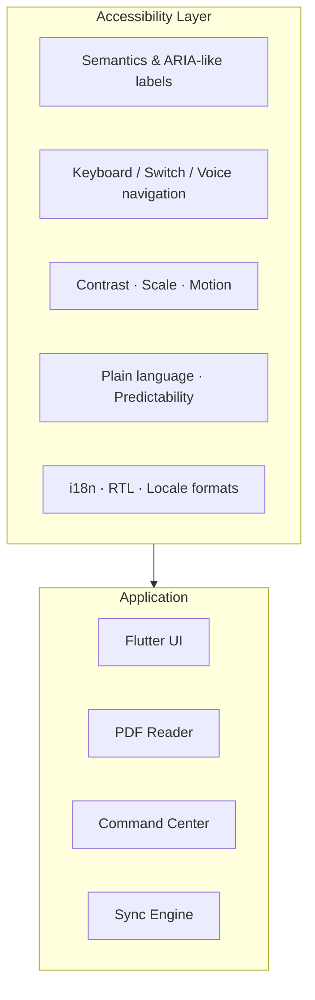

# Atlas Reader — Master Plan
## Universal Embedding Protocol · Maximum Accessibility · Production Quality

**Status:** Phase 1 PoC → Phase 2 Hardening

**Last updated:** September 2026

**Platforms:** Windows (primary PoC), Android (target parity)

**Accessibility target:** WCAG 2.2 Level AA minimum · AAA where feasible
**Quality bar:** Every feature shippable only when accessible, localizable, and recoverable from failure

---

## I. North Star

Atlas Reader is a **decentralized reading and research ecosystem** where the document itself is the database. Bookmarks, notes, tags, and hierarchy are embedded in PDF/EPUB files and mirrored locally for speed—never trapped in a proprietary silo.

### Design principles (non-negotiable)

| Principle | Meaning |
|-----------|---------|
| **Document is database** | File outline is source of truth; local DB is a performance mirror |
| **Accessibility first** | Not a polish pass—built into architecture, UI kit, and acceptance criteria |
| **Offline by default** | No network required; sync is file-local |
| **Fail safe, fail visible** | Errors are announced, recoverable, and never silent |
| **Unicode everywhere** | Arabic, RTL, combining marks, long paths—first-class citizens |
| **Progressive disclosure** | Simple default UI; power features discoverable without clutter |
| **Undo over confirm** | Confirm only for irreversible actions; everything else undoable |

---

## II. The Five Pillars

Previous docs described four features. This plan adds a **fifth pillar** that governs all others:

### Pillar 0 — Inclusive Access (cross-cutting)

Every screen, control, and workflow must pass accessibility review before merge.

### Pillar 1 — Universal Mirror Bookmarking

Dual-layer save: SQLite (instant) + file outline (portable).

### Pillar 2 — Semantic Enrichment

Titles, Markdown descriptions, tags, folder hierarchy.

### Pillar 3 — Command Center

Global FTS search across the entire library with hierarchical context.

### Pillar 4 — Bi-Directional Sync

PDF ↔ DB reconcile with path-based identity and preview-before-commit.

---

## III. Accessibility Architecture

Accessibility is not a theme toggle—it is a **layer** that every module must satisfy.



### III.A Perceivable (WCAG 1.x)

| Requirement | Implementation |
|-------------|----------------|
| **Text alternatives** | Every icon button has `tooltip` + `Semantics(label, hint, button)` |
| **Color contrast** | AA: 4.5:1 body text, 3:1 large text; never encode state by color alone |
| **Resize text** | Respect system `textScaleFactor` up to 200%; no clipped overflow |
| **Reflow** | Layouts work at 320 CSS px width; bookmark tree wraps, does not truncate silently |
| **Non-text contrast** | Focus rings, expansion chevrons, sync status icons meet 3:1 |
| **Reduced motion** | Honor `MediaQuery.disableAnimations`; collapse tree instantly when requested |
| **PDF content** | Reader zoom independent of UI scale; high-contrast reading mode |

**Theme tokens (mandatory):**

```
light / dark / high-contrast
├── surface, onSurface, primary, error
├── bookmark-leaf, bookmark-folder, sync-add, sync-delete
├── focusRing (visible 2px, offset 2px)
└── minTouchTarget: 48×48 dp (Android) · 40×40 pt with 8pt padding (Windows)
```

### III.B Operable (WCAG 2.x)

| Requirement | Implementation |
|-------------|----------------|
| **Keyboard complete** | Tab order logical; all actions reachable without mouse |
| **No keyboard trap** | ExpansionTile, dialogs, search field escapable |
| **Skip links** | “Skip to bookmarks”, “Skip to search” on desktop |
| **Shortcuts** | `Ctrl+O` open, `Ctrl+F` search, `Ctrl+S` commit, `Delete` with focus context |
| **Focus visible** | Never `FocusNode(canRequestFocus: false)` on interactive tiles |
| **Target size** | Minimum 44×44 logical pixels for all tappable controls |
| **Gestures** | No path-only gestures; always provide button alternative |
| **Seizures** | No flashing > 3 Hz |

**Windows keyboard map (target):**

| Key | Action |
|-----|--------|
| `Ctrl+O` | Open PDF |
| `Ctrl+F` / `Ctrl+K` | Command Center focus |
| `Enter` | Activate focused bookmark / expand node |
| `Space` | Toggle expansion |
| `Arrow Up/Down` | Move in tree (when tree focused) |
| `Arrow Right/Left` | Expand / collapse |
| `Delete` | Delete focused bookmark (with undo snackbar) |
| `Ctrl+Z` | Undo last local edit |
| `Ctrl+Shift+S` | Commit changes to PDF |
| `Escape` | Close dialog / clear search |

**Android:**

| Pattern | Action |
|---------|--------|
| TalkBack | Full traversal of tree with “level N bookmark, page X, book Y” |
| Switch Access | Same semantics as keyboard tree |
| System back | Closes overlay, never loses unsaved work silently |

### III.C Understandable (WCAG 3.x)

| Requirement | Implementation |
|-------------|----------------|
| **Language** | `MaterialApp.locale`, `localizationsDelegates`; `lang` on user content |
| **Predictable** | Navigation consistent; no context change on focus alone |
| **Input assistance** | Labels always visible; errors linked via `Semantics` |
| **Error identification** | “Page number must be between 1 and {max}” not “Invalid input” |
| **Confirm destructive** | Remove book, commit deletions—dialog with plain summary |
| **Undo** | Snackbar “Bookmark deleted · Undo” for single deletes |

**Plain-language status messages:**

| Internal | User-facing |
|----------|-------------|
| `reconcile returned null` | “Could not update the PDF. Close it in other apps and try again.” |
| `0 adds, 0 deletes` | “Already in sync—no changes needed.” |
| `syncBookmarkHierarchy` | “Imported 12 new bookmarks from your PDF.” |

### III.D Robust (WCAG 4.x)

| Requirement | Implementation |
|-------------|----------------|
| **Semantics tree** | No duplicate `Semantics` on parent + child for same action |
| **Live regions** | `SemanticsService.announce` for sync complete, import count |
| **Custom controls** | Bookmark tree nodes expose `expanded`, `selected`, `level` |
| **Platform channels** | Windows Narrator and Android TalkBack tested each release |

### III.E Cognitive & learning accessibility

| Feature | Detail |
|---------|--------|
| **Onboarding** | 3-step first-run: pick book → sync → search (skippable, replayable) |
| **Empty states** | Illustration + one primary action + one sentence explanation |
| **Progress** | Sync/commit show determinate progress when > 300 ms |
| **Chunking** | Sync preview groups adds/deletes with counts before commit |
| **Consistent icons** | Folder = outline folder; leaf = bookmark; book = menu_book everywhere |
| **Reading mode** | Optional dyslexia-friendly UI font (OpenDyslexic or Atkinson Hyperlegible) |
| **Distraction-free** | Hide inject panel when browsing bookmarks |

### III.F Internationalization & RTL

Critical for Arabic PDFs (e.g. أصول الفقه على منهج أهل السنة).

| Area | Requirement |
|------|-------------|
| **UI RTL** | `Directionality` from locale; mirrored layouts in Arabic |
| **Bookmark text** | Store UTF-8; never normalize away Arabic characters |
| **Path display** | Use locale-appropriate separator (` › ` LTR, ` ‹ ` or ` / ` RTL) |
| **Search** | FTS5 `unicode61` tokenizer; test Arabic query matching |
| **PDF outline** | Syncfusion write preserves Unicode titles; verify in Acrobat |
| **Numbers** | Page labels respect locale (`Page ٤٢` vs `Page 42`) via `intl` |
| **Filenames** | Full path display with bidi isolates for mixed LTR/RTL paths |

**Launch locales (priority):**

1. English (en)
2. Arabic (ar) — RTL
3. French, Spanish (community phase)

---

## IV. Perfection Standards (Definition of Done)

A feature is **done** only when all checkboxes pass:

### Code quality

- [ ] Unit tests for domain logic (tree, sync, path keys)
- [ ] Widget test for primary UI states (empty, loading, error, populated)
- [ ] `flutter analyze` clean
- [ ] No nested `ListTile` without `Material` ancestor (fixes ink/contrast exceptions)

### Accessibility

- [ ] VoiceOver / TalkBack / Narrator walkthrough recorded
- [ ] Keyboard-only walkthrough passes
- [ ] 200% text scale screenshot review
- [ ] High-contrast theme screenshot review
- [ ] Reduced-motion behavior verified

### Reliability

- [ ] Safe PDF overwrite with locked-file error message
- [ ] Missing-file relocation flow tested
- [ ] Transaction rollback on DB failure
- [ ] Idempotent sync (running twice produces zero diff)

### UX

- [ ] Loading state within 100 ms feedback
- [ ] Error state with recovery action
- [ ] Success state with `Semantics` announcement
- [ ] Empty state with next step

---

## V. System Architecture

### V.A Layer diagram

```
┌─────────────────────────────────────────────────────────────┐
│  Presentation                                                │
│  ├── LibraryScreen      ├── ReaderScreen                     │
│  ├── CommandCenter      ├── SyncReviewSheet                  │
│  └── SettingsA11y       └── OnboardingFlow                   │
├─────────────────────────────────────────────────────────────┤
│  Application Services                                        │
│  ├── BookmarkService    ├── LibraryScanner                   │
│  ├── SyncOrchestrator   ├── SearchService                    │
│  └── UndoController     └── AccessibilityAnnouncer           │
├─────────────────────────────────────────────────────────────┤
│  Domain                                                      │
│  ├── BookmarkTree       ├── BookmarkGrouping                 │
│  ├── SyncEngine         └── PathIdentity                     │
├─────────────────────────────────────────────────────────────┤
│  Infrastructure                                              │
│  ├── AppDatabase (Drift + FTS5)                              │
│  ├── PdfEngine (outline R/W)                                 │
│  ├── FileAbstraction (Windows IO · Android SAF)              │
│  └── SafeFileWriter (.tmp → verify → rename)                 │
└─────────────────────────────────────────────────────────────┘
```

### V.B Module map (current → target)

| Module | Today | Target |
|--------|-------|--------|
| `main.dart` | Bootstrap-only entry point | Split remaining library coordinator + `AccessibilityAnnouncer` |
| `features/library/library_screen.dart` | Current workspace coordinator | Smaller library-specific controllers |
| `core/file_system/` | Document I/O interface + Windows adapter | Android SAF adapter |
| `database.dart` | Drift schema v4 + path snapshots | + migration discipline |
| `pdf_engine.dart` | Syncfusion extract/inject | Evaluate PDFium; keep same interface |
| `sync_engine.dart` | Path diff + full tree rewrite | Incremental patch + full rewrite fallback |
| `bookmark_tree.dart` | Forest builder | + `SemanticsNode` metadata helpers |
| `bookmark_grouping.dart` | Sort/group | + locale-aware sort (collation) |
| **new** `a11y/` | — | Semantics wrappers, focus policy, shortcuts |
| **new** `l10n/` | — | ARB files, RTL layout tests |
| **new** `design_system/` | — | Tokens, themes, accessible components |

### V.C Data model (refined)

**bookmarks**

| Column | Notes |
|--------|-------|
| `id` | PK |
| `file_path` | UTF-8 full path |
| `title` | Unicode outline title |
| `page_index` | Nullable for folders |
| `description` | Markdown; DB + future XMP |
| `parent_id` | FK cascade |
| `is_folder` | Container node |
| `sort_order` | **NEW:** preserve PDF sibling order |
| `uuid` | **NEW:** stable cross-sync identity |
| `created_at` / `updated_at` | |

**file_snapshots** — store JSON tree of path keys, not flat titles:

```json
{
  "version": 2,
  "paths": ["Vol 1 › Index", "Vol 1 › Chapter 1 › Section A"],
  "file_hash": "sha256:…"
}
```

---

## VI. Feature Specifications (with A11y)

### Feature 1 — Mirror Bookmarking

**Flow:** Inject → DB insert → background PDF write → announce success.

| A11y requirement |
|------------------|
| Inject button: “Add bookmark to current book, page {n}” |
| Live announcement: “Bookmark saved locally. Updating PDF in background.” |
| Failure announcement: “PDF is open elsewhere. Close it and tap Retry.” |

### Feature 2 — Semantic Enrichment

**Fields:** title, description (Markdown), tags, hierarchy.

| A11y requirement |
|------------------|
| Edit dialog: focus trap with labeled fields |
| Tag chips: readable as “tag: research, removable” |
| Markdown preview: optional plain-text mode for screen readers |

### Feature 3 — Command Center

**Flow:** FTS query → results with breadcrumb path → activate opens book at page.

| A11y requirement |
|------------------|
| Search field: `Semantics(label: 'Search all bookmarks')` |
| Result: “{title}, page {n}, in {book}, path {breadcrumb}” |
| `Ctrl+K` opens and focuses search from anywhere |
| Results list: arrow-key navigable |

### Feature 4 — Bi-Directional Sync

**Flow:** Diff by path → preview → commit → verify.

| A11y requirement |
|------------------|
| Preview: “12 to add, 3 to remove” summary at top |
| Each diff row: action + path + page, not color-only |
| Commit disabled until preview reviewed (first-time users) |
| Success: “PDF updated. 12 bookmarks written.” |

### Feature 5 — Hierarchical Library View

**Flow:** Book → tree → leaf actions (edit, delete, go to page).

| A11y requirement |
|------------------|
| Tree items: `level: 1..n` in semantics |
| Expand/collapse state exposed |
| Remove book: confirmation names count + filename |
| **Fix:** Wrap tree rows in `Material` to eliminate ink splash exceptions |
| Prefer `MergeSemantics` carefully—don’t hide action buttons |

---

## VII. UI / UX Design System

### VII.A Layout zones (target production)

```
┌──────────────────────────────────────────────────────────┐
│ AppBar · Book title · Sync status · Settings               │
├───────────────┬──────────────────────────────────────────┤
│  Library      │  Reader OR Bookmark Manager               │
│  (collapsible)│  ┌────────────────────────────────────┐  │
│               │  │ PDF page / tree                      │  │
│  · Recent     │  └────────────────────────────────────┘  │
│  · Folders    │  [Add bookmark] [Sync] [Commit]          │
├───────────────┴──────────────────────────────────────────┤
│ Command Center (overlay, Ctrl+K)                         │
└──────────────────────────────────────────────────────────┘
```

### VII.B Component library (accessible)

| Component | Behavior |
|-----------|----------|
| `AtlasBookmarkTile` | Material wrapper, semantics, 48dp min height |
| `AtlasExpansionNode` | Custom expand (not raw nested ListTile) |
| `AtlasConfirmDialog` | Focus on cancel by default for destructive |
| `AtlasSyncBadge` | Icon + text label always |
| `AtlasSearchField` | Clear button with label “Clear search” |
| `AtlasUndoSnackBar` | Action “Undo” with keyboard shortcut hint |

### VII.C Motion & feedback

| Duration | Use |
|----------|-----|
| 0 ms | When `reduceMotion` |
| 150 ms | Micro-feedback (chip add) |
| 300 ms | Panel expand |
| > 300 ms | Show progress indicator |

Haptic: light impact on successful commit (Android); optional system sound (Windows).

---

## VIII. Sync & Reliability Perfection

### VIII.A Identity

Bookmark = `(file_path, path_key)` where `path_key = title₁ › title₂ › …`.

Future: `(file_uuid, bookmark_uuid)` when XMP UUIDs land.

### VIII.B Reconcile algorithm (target)

```
1. Extract PDF tree → path set P
2. Load DB tree → path set D
3. diff_add = D - P, diff_remove = P - D
4. If diff_add ∪ diff_remove ≠ ∅:
     a. Try incremental patch (add/remove nodes by path)
     b. On failure → full overwriteBookmarkTree(D)
5. Import P - D into DB (external edits)
6. Snapshot with path keys + file hash
7. Announce result to assistive tech
```

### VIII.C Failure recovery

| Failure | Recovery |
|---------|----------|
| PDF locked | Retry button + explain which apps to close |
| Partial write | `.tmp` never promoted; original intact |
| DB migration fail | Backup `atlas_db.sqlite.bak` before migrate |
| Corrupt outline | Offer “Reset from DB” or “Re-import from PDF” |
| Moved file | Existing relocate dialog (keep improving path display) |

---

## IX. Testing Strategy

### IX.A Pyramid

```
        ┌─────────────┐
        │  Manual A11y │  Narrator, TalkBack, keyboard
        ├─────────────┤
        │  Integration │  Sync PDF ↔ DB golden files
        ├─────────────┤
        │  Widget      │  Semantics matchers, golden screenshots
        ├─────────────┤
        │  Unit        │  BookmarkTree, path keys, FTS queries
        └─────────────┘
```

### IX.B Accessibility test matrix (each release)

| Test | Windows | Android |
|------|---------|---------|
| Narrator / TalkBack browse | ✓ | ✓ |
| Keyboard-only full task | ✓ | N/A |
| Switch Access | N/A | ✓ |
| 200% text scale | ✓ | ✓ |
| High contrast | ✓ | ✓ |
| RTL Arabic UI | ✓ | ✓ |
| Arabic bookmark search | ✓ | ✓ |

### IX.C Golden PDF fixtures

| Fixture | Purpose |
|---------|---------|
| `nested_outline.pdf` | 3-level hierarchy |
| `arabic_unicode.pdf` | RTL titles (real user content class) |
| `duplicate_titles.pdf` | Same title, different parents |
| `empty_outline.pdf` | Edge case import |
| `locked.pdf` | Simulate open-in-Acrobat error path |

---

## X. Roadmap (Accessibility Gates)

### Phase 1 — PoC ✅ → Hardening (Weeks 1–8)

**Done:**
- Dual-layer save, Drift + FTS5, hierarchical sync, Command Center search, remove book

**Completed in Stage 1:**

- Material-backed bookmark and expansion rows; the nested `ListTile` warning is resolved.
- Version 2 full-path snapshots, with legacy flat-title snapshots readable.
- Validated temporary PDF output and recovery-file replacement.
- Tree, snapshot, diff, and initial-widget test coverage.

**Remaining (with a11y gate):**

| Task | A11y gate |
|------|-----------|
| Split `main.dart` into modules | Each screen has semantics audit |
| Add `AccessibilityAnnouncer` for sync events | Live region announcements |
| High-contrast + dark themes | Contrast audit pass |
| Keyboard shortcuts (desktop) | Full keyboard task completion |
| `sort_order` column + PDF order preserved | Screen reader order matches visual |

**Phase 1 exit criteria:** Arabic PDF with 16+ nested bookmarks—full keyboard + Narrator task without mouse.

---

### Phase 2 — Reader & UEP Hardening (Weeks 9–16)

| Deliverable | A11y gate |
|-------------|-----------|
| PDF viewer with page nav | Zoom, keyboard page flip, focus not trapped |
| UUID in metadata | — |
| Incremental sync | Status announcements for long ops |
| Description → XMP or annotation | Plain-text fallback for AT |
| Undo stack for edits | Undo announced and keyboard accessible |
| File Abstraction Layer (SAF) | Android folder picker accessible |

**Phase 2 exit criteria:** Create bookmark from reader, commit, open in Acrobat—verify hierarchy + Arabic titles.

---

### Phase 3 — Library & Command Center (Weeks 17–24)

| Deliverable | A11y gate |
|-------------|-----------|
| Folder scanner isolate | Progress announced |
| Command Center overlay | Modal focus trap, Esc closes |
| Search descriptions in FTS | Results readable in full |
| EPUB support | Same tree semantics as PDF |
| l10n: en + ar | RTL layout test suite green |

**Phase 3 exit criteria:** 100 PDFs indexed; search < 100 ms; Arabic UI fully mirrored.

---

### Phase 4 — Excellence & Beta (Weeks 25–32)

| Deliverable | A11y gate |
|-------------|-----------|
| Batch edit + shift pages | Multi-select with checkbox semantics |
| Clean-up merge UI | Diff readable line-by-line |
| Dyslexia font option | Applies to UI chrome, not PDF content |
| Onboarding + help | Skip link, replay from settings |
| Riverpod + design system | All components from accessible kit |
| Beta feedback loop | A11y bug priority = P0 |

**Phase 4 exit criteria:** WCAG 2.2 AA audit documented; beta users complete core tasks with assistive tech.

---

## XI. Known Issues → Planned Fixes

| Issue | Root cause | Fix |
|-------|------------|-----|
| Full tree rewrite every commit | Simplicity in PoC | Incremental patch with fallback |
| Descriptions not in PDF | Syncfusion limits | XMP sidecar or PDF annotation layer |
| README outdated | Doc drift | Point README → this PLAN.md |
| No reader | PoC scope | Phase 2 PDF viewer |
| Monolithic main.dart | PoC velocity | Phase 1 module split |

---

## XII. Success Metrics

### Accessibility KPIs

| Metric | Target |
|--------|--------|
| WCAG 2.2 AA violations (automated) | 0 critical |
| Keyboard task completion rate | 100% core flows |
| Screen reader task completion (lab) | 100% core flows |
| User-reported a11y bugs in beta | < 5 per month, P0 fixed in 7 days |

### Product KPIs

| Metric | Target |
|--------|--------|
| Sync idempotency | Second sync = 0 diff |
| Search latency (10k bookmarks) | < 100 ms p95 |
| PDF write failure recovery | 100% no corruption |
| Arabic outline round-trip | Byte-identical titles |

### Quality KPIs

| Metric | Target |
|--------|--------|
| Unit test coverage (domain) | > 80% |
| `flutter analyze` | 0 issues |
| Crash-free sessions | > 99.5% |

---

## XIII. Immediate Next Actions (Priority)

1. **Add `AccessibilityAnnouncer`** — wrap sync/commit/import outcomes.
2. **Implement keyboard shortcuts** — `Ctrl+K`, `Ctrl+O`, tree arrows.
3. **Add dark + high-contrast themes** — verify contrast ratios.
4. **Add Arabic ARB + RTL test** — `flutter gen-l10n`, mirror layouts.
5. **Split UI from `main.dart`** — Library, BookmarkManager, SyncReview.
6. **Golden-file sync tests** — including Arabic nested PDF fixture.

---

## XIV. References

- [WCAG 2.2](https://www.w3.org/TR/WCAG22/)
- [Flutter Accessibility](https://docs.flutter.dev/ui/accessibility-and-internationalization/accessibility)
- [Material Accessibility](https://m3.material.io/foundations/accessible-design)
- [Android Accessibility](https://developer.android.com/guide/topics/ui/accessibility)
- [Windows Narrator](https://learn.microsoft.com/en-us/windows/accessibility/narrator)
- [PDF 32000 Outlines](https://opensource.adobe.com/dc-acrobat-sdk-docs/standards/pdfstandards/pdf/PDF32000_2008.pdf)
- [Drift ORM](https://drift.simonbinder.eu/)
- [SQLite FTS5 Unicode](https://www.sqlite.org/fts5.html)

---

*This document supersedes informal planning in README §V–VI for execution purposes. README remains the vision narrative; PLAN.md is the engineering and accessibility contract.*
