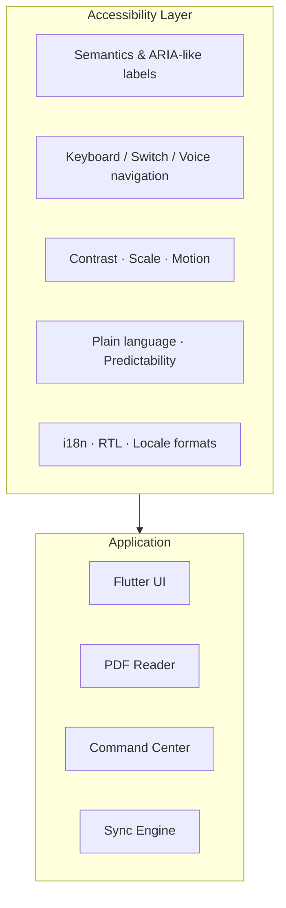

# Atlas Reader — Master Plan
## Universal Embedding Protocol · Maximum Accessibility · Production Quality

**Status:** `0.8.0-beta.2` reader-workspace candidate verified (53 tests passed,
2 optional personal-file audits skipped, 3 native Windows integration scenarios
passed, and the release build succeeded); C0 was owner-accepted on 2026-09-09
and C1 is ready for owner testing.
Historical Stages 1–11 remain in the repository, but only library discovery,
bookmarking, PDF reading, and PDF writing are in the primary product surface.
Stage 12 and later are deferred.

**Last updated:** September 2026

**Platforms:** Windows (primary implementation), Android (target parity)

**Accessibility target:** WCAG 2.2 Level AA minimum · AAA where feasible
**Quality bar:** Every feature shippable only when accessible, localizable, and recoverable from failure

**Developer acceleration:** A local CodeGraph index is the primary repository
knowledge base. Read-only GitHub MCP handles focused remote metadata, while
cloud workflows handle formatting, analysis, tests, coverage output, and beta
Windows compilation. Overlapping AI indexing/review services are deliberately
excluded until they add measurable value beyond this small trusted toolchain.

---

## I. North Star

Atlas Reader is a **decentralized reading and research ecosystem** where the document itself is the database. Bookmarks, notes, tags, and hierarchy are embedded in PDF/EPUB files and mirrored locally for speed—never trapped in a proprietary silo.

### Design principles (non-negotiable)

| Principle | Meaning |
|-----------|---------|
| **Document is database** | File outline is source of truth; local DB is a performance mirror |
| **Accessibility first** | Not a polish pass—built into architecture, UI kit, and acceptance criteria |
| **Offline by default** | No network required; sync is file-local |
| **Fail safe, fail visible** | Errors are announced, recoverable, and never silent |
| **Unicode everywhere** | Arabic, RTL, combining marks, long paths—first-class citizens |
| **Progressive disclosure** | Simple default UI; power features discoverable without clutter |
| **Undo over confirm** | Confirm only for irreversible actions; everything else undoable |

---

## II. The Five Pillars

Previous docs described four features. This plan adds a **fifth pillar** that governs all others:

### Pillar 0 — Inclusive Access (cross-cutting)

Every screen, control, and workflow must pass accessibility review before merge.

### Pillar 1 — Universal Mirror Bookmarking

Dual-layer save: SQLite (instant) + file outline (portable).

### Pillar 2 — Semantic Enrichment

Titles, Markdown descriptions, tags, folder hierarchy.

### Pillar 3 — Command Center

Global FTS search across the entire library with hierarchical context.

### Pillar 4 — Bi-Directional Sync

PDF ↔ DB reconcile with path-based identity and preview-before-commit.

---

## III. Accessibility Architecture

Accessibility is not a theme toggle—it is a **layer** that every module must satisfy.



### III.A Perceivable (WCAG 1.x)

| Requirement | Implementation |
|-------------|----------------|
| **Text alternatives** | Every icon button has `tooltip` + `Semantics(label, hint, button)` |
| **Color contrast** | AA: 4.5:1 body text, 3:1 large text; never encode state by color alone |
| **Resize text** | Respect system `textScaleFactor` up to 200%; no clipped overflow |
| **Reflow** | Layouts work at 320 CSS px width; bookmark tree wraps, does not truncate silently |
| **Non-text contrast** | Focus rings, expansion chevrons, sync status icons meet 3:1 |
| **Reduced motion** | Honor `MediaQuery.disableAnimations`; collapse tree instantly when requested |
| **PDF content** | Reader zoom independent of UI scale; high-contrast reading mode |

**Theme tokens (mandatory):**

```
light / dark / high-contrast
├── surface, onSurface, primary, error
├── bookmark-leaf, bookmark-folder, sync-add, sync-delete
├── focusRing (visible 2px, offset 2px)
└── minTouchTarget: 48×48 dp (Android) · 40×40 pt with 8pt padding (Windows)
```

### III.B Operable (WCAG 2.x)

| Requirement | Implementation |
|-------------|----------------|
| **Keyboard complete** | Tab order logical; all actions reachable without mouse |
| **No keyboard trap** | ExpansionTile, dialogs, search field escapable |
| **Skip links** | “Skip to bookmarks”, “Skip to search” on desktop |
| **Shortcuts** | `Ctrl+O` open, `Ctrl+F` search, `Ctrl+S` commit, `Delete` with focus context |
| **Focus visible** | Never `FocusNode(canRequestFocus: false)` on interactive tiles |
| **Target size** | Minimum 44×44 logical pixels for all tappable controls |
| **Gestures** | No path-only gestures; always provide button alternative |
| **Seizures** | No flashing > 3 Hz |

**Windows keyboard map (target):**

| Key | Action |
|-----|--------|
| `Ctrl+O` | Open PDF |
| `Ctrl+F` / `Ctrl+K` | Command Center focus |
| `Enter` | Activate focused bookmark / expand node |
| `Space` | Toggle expansion |
| `Arrow Up/Down` | Move in tree (when tree focused) |
| `Arrow Right/Left` | Expand / collapse |
| `Delete` | Delete focused bookmark (with undo snackbar) |
| `Ctrl+Z` | Undo last local edit |
| `Ctrl+Shift+S` | Commit changes to PDF |
| `Escape` | Close dialog / clear search |

**Android:**

| Pattern | Action |
|---------|--------|
| TalkBack | Full traversal of tree with “level N bookmark, page X, book Y” |
| Switch Access | Same semantics as keyboard tree |
| System back | Closes overlay, never loses unsaved work silently |

### III.C Understandable (WCAG 3.x)

| Requirement | Implementation |
|-------------|----------------|
| **Language** | `MaterialApp.locale`, `localizationsDelegates`; `lang` on user content |
| **Predictable** | Navigation consistent; no context change on focus alone |
| **Input assistance** | Labels always visible; errors linked via `Semantics` |
| **Error identification** | “Page number must be between 1 and {max}” not “Invalid input” |
| **Confirm destructive** | Remove book, commit deletions—dialog with plain summary |
| **Undo** | Snackbar “Bookmark deleted · Undo” for single deletes |

**Plain-language status messages:**

| Internal | User-facing |
|----------|-------------|
| `reconcile returned null` | “Could not update the PDF. Close it in other apps and try again.” |
| `0 adds, 0 deletes` | “Already in sync—no changes needed.” |
| `syncBookmarkHierarchy` | “Imported 12 new bookmarks from your PDF.” |

### III.D Robust (WCAG 4.x)

| Requirement | Implementation |
|-------------|----------------|
| **Semantics tree** | No duplicate `Semantics` on parent + child for same action |
| **Live regions** | `SemanticsService.announce` for sync complete, import count |
| **Custom controls** | Bookmark tree nodes expose `expanded`, `selected`, `level` |
| **Platform channels** | Windows Narrator and Android TalkBack tested each release |

### III.E Cognitive & learning accessibility

| Feature | Detail |
|---------|--------|
| **Onboarding** | 3-step first-run: pick book → sync → search (skippable, replayable) |
| **Empty states** | Illustration + one primary action + one sentence explanation |
| **Progress** | Sync/commit show determinate progress when > 300 ms |
| **Chunking** | Sync preview groups adds/deletes with counts before commit |
| **Consistent icons** | Folder = outline folder; leaf = bookmark; book = menu_book everywhere |
| **Reading mode** | Optional dyslexia-friendly UI font (OpenDyslexic or Atkinson Hyperlegible) |
| **Distraction-free** | Hide inject panel when browsing bookmarks |

### III.F Internationalization & RTL

Critical for Arabic PDFs (e.g. أصول الفقه على منهج أهل السنة).

| Area | Requirement |
|------|-------------|
| **UI RTL** | `Directionality` from locale; mirrored layouts in Arabic |
| **Bookmark text** | Store UTF-8; never normalize away Arabic characters |
| **Path display** | Use locale-appropriate separator (` › ` LTR, ` ‹ ` or ` / ` RTL) |
| **Search** | FTS5 `unicode61` tokenizer; test Arabic query matching |
| **PDF outline** | Syncfusion write preserves Unicode titles; verify in Acrobat |
| **Numbers** | Page labels respect locale (`Page ٤٢` vs `Page 42`) via `intl` |
| **Filenames** | Full path display with bidi isolates for mixed LTR/RTL paths |

**Launch locales (priority):**

1. English (en)
2. Arabic (ar) — RTL
3. French, Spanish (community phase)

---

## IV. Perfection Standards (Definition of Done)

A feature is **done** only when all checkboxes pass:

### Code quality

- [ ] Unit tests for domain logic (tree, sync, path keys)
- [ ] Widget test for primary UI states (empty, loading, error, populated)
- [ ] `flutter analyze` clean
- [ ] No nested `ListTile` without `Material` ancestor (fixes ink/contrast exceptions)

### Accessibility

- [ ] VoiceOver / TalkBack / Narrator walkthrough recorded
- [ ] Keyboard-only walkthrough passes
- [ ] 200% text scale screenshot review
- [ ] High-contrast theme screenshot review
- [ ] Reduced-motion behavior verified

### Reliability

- [ ] Safe PDF overwrite with locked-file error message
- [ ] Missing-file relocation flow tested
- [ ] Transaction rollback on DB failure
- [ ] Idempotent sync (running twice produces zero diff)

### UX

- [ ] Loading state within 100 ms feedback
- [ ] Error state with recovery action
- [ ] Success state with `Semantics` announcement
- [ ] Empty state with next step

---

## V. System Architecture

### V.A Layer diagram

```
┌─────────────────────────────────────────────────────────────┐
│  Presentation                                                │
│  ├── LibraryScreen      ├── ReaderScreen                     │
│  ├── CommandCenter      ├── SyncReviewSheet                  │
│  └── SettingsA11y       └── OnboardingFlow                   │
├─────────────────────────────────────────────────────────────┤
│  Application Services                                        │
│  ├── BookmarkService    ├── LibraryScanner                   │
│  ├── SyncOrchestrator   ├── SearchService                    │
│  └── UndoController     └── AccessibilityAnnouncer           │
├─────────────────────────────────────────────────────────────┤
│  Domain                                                      │
│  ├── BookmarkTree       ├── BookmarkGrouping                 │
│  ├── SyncEngine         └── PathIdentity                     │
├─────────────────────────────────────────────────────────────┤
│  Infrastructure                                              │
│  ├── AppDatabase (Drift + FTS5)                              │
│  ├── PdfEngine (outline R/W)                                 │
│  ├── FileAbstraction (Windows IO · Android SAF)              │
│  └── SafeFileWriter (.tmp → verify → rename)                 │
└─────────────────────────────────────────────────────────────┘
```

### V.B Module map (current → target)

| Module | Today | Target |
|--------|-------|--------|
| `main.dart` | Bootstrap-only entry point | Split remaining library coordinator + `AccessibilityAnnouncer` |
| `features/library/library_screen.dart` | Current workspace coordinator | Smaller library-specific controllers |
| `core/file_system/` | Document I/O interface + Windows adapter | Android SAF adapter |
| `database.dart` | Drift schema v5 + path snapshots and library index | + migration discipline |
| `pdf_engine.dart` | Syncfusion extract/inject | Evaluate PDFium; keep same interface |
| `sync_engine.dart` | Path diff + full tree rewrite | Incremental patch + full rewrite fallback |
| `bookmark_tree.dart` | Forest builder | + `SemanticsNode` metadata helpers |
| `bookmark_grouping.dart` | Sort/group | + locale-aware sort (collation) |
| **new** `a11y/` | — | Semantics wrappers, focus policy, shortcuts |
| **new** `l10n/` | — | ARB files, RTL layout tests |
| **new** `design_system/` | — | Tokens, themes, accessible components |

### V.C Data model (refined)

**bookmarks**

| Column | Notes |
|--------|-------|
| `id` | PK |
| `file_path` | UTF-8 full path |
| `title` | Unicode outline title |
| `page_index` | Nullable for folders |
| `description` | Markdown; DB + future XMP |
| `parent_id` | FK cascade |
| `is_folder` | Container node |
| `sort_order` | **NEW:** preserve PDF sibling order |
| `uuid` | **NEW:** stable cross-sync identity |
| `created_at` / `updated_at` | |

**file_snapshots** — store JSON tree of path keys, not flat titles:

```json
{
  "version": 2,
  "paths": ["Vol 1 › Index", "Vol 1 › Chapter 1 › Section A"],
  "file_hash": "sha256:…"
}
```

---

## VI. Feature Specifications (with A11y)

### Feature 1 — Mirror Bookmarking

**Flow:** Inject → DB insert → background PDF write → announce success.

| A11y requirement |
|------------------|
| Inject button: “Add bookmark to current book, page {n}” |
| Live announcement: “Bookmark saved locally. Updating PDF in background.” |
| Failure announcement: “PDF is open elsewhere. Close it and tap Retry.” |

### Feature 2 — Semantic Enrichment

**Fields:** title, description (Markdown), tags, hierarchy.

| A11y requirement |
|------------------|
| Edit dialog: focus trap with labeled fields |
| Tag chips: readable as “tag: research, removable” |
| Markdown preview: optional plain-text mode for screen readers |

### Feature 3 — Command Center

**Flow:** FTS query → results with breadcrumb path → activate opens book at page.

| A11y requirement |
|------------------|
| Search field: `Semantics(label: 'Search all bookmarks')` |
| Result: “{title}, page {n}, in {book}, path {breadcrumb}” |
| `Ctrl+K` opens and focuses search from anywhere |
| Results list: arrow-key navigable |

### Feature 4 — Bi-Directional Sync

**Flow:** Diff by path → preview → commit → verify.

| A11y requirement |
|------------------|
| Preview: “12 to add, 3 to remove” summary at top |
| Each diff row: action + path + page, not color-only |
| Commit disabled until preview reviewed (first-time users) |
| Success: “PDF updated. 12 bookmarks written.” |

### Feature 5 — Hierarchical Library View

**Flow:** Book → tree → leaf actions (edit, delete, go to page).

| A11y requirement |
|------------------|
| Tree items: `level: 1..n` in semantics |
| Expand/collapse state exposed |
| Remove book: confirmation names count + filename |
| **Fix:** Wrap tree rows in `Material` to eliminate ink splash exceptions |
| Prefer `MergeSemantics` carefully—don’t hide action buttons |

---

## VII. UI / UX Design System

### VII.A Layout zones (target production)

```
┌──────────────────────────────────────────────────────────┐
│ AppBar · Book title · Sync status · Settings               │
├───────────────┬──────────────────────────────────────────┤
│  Library      │  Reader OR Bookmark Manager               │
│  (collapsible)│  ┌────────────────────────────────────┐  │
│               │  │ PDF page / tree                      │  │
│  · Recent     │  └────────────────────────────────────┘  │
│  · Folders    │  [Add bookmark] [Sync] [Commit]          │
├───────────────┴──────────────────────────────────────────┤
│ Command Center (overlay, Ctrl+K)                         │
└──────────────────────────────────────────────────────────┘
```

### VII.B Component library (accessible)

| Component | Behavior |
|-----------|----------|
| `AtlasBookmarkTile` | Material wrapper, semantics, 48dp min height |
| `AtlasExpansionNode` | Custom expand (not raw nested ListTile) |
| `AtlasConfirmDialog` | Focus on cancel by default for destructive |
| `AtlasSyncBadge` | Icon + text label always |
| `AtlasSearchField` | Clear button with label “Clear search” |
| `AtlasUndoSnackBar` | Action “Undo” with keyboard shortcut hint |

### VII.C Motion & feedback

| Duration | Use |
|----------|-----|
| 0 ms | When `reduceMotion` |
| 150 ms | Micro-feedback (chip add) |
| 300 ms | Panel expand |
| > 300 ms | Show progress indicator |

Haptic: light impact on successful commit (Android); optional system sound (Windows).

---

## VIII. Sync & Reliability Perfection

### VIII.A Identity

Bookmark = `(file_path, path_key)` where `path_key = title₁ › title₂ › …`.

Future: `(file_uuid, bookmark_uuid)` when XMP UUIDs land.

### VIII.B Reconcile algorithm (target)

```
1. Extract PDF tree → path set P
2. Load DB tree → path set D
3. diff_add = D - P, diff_remove = P - D
4. If diff_add ∪ diff_remove ≠ ∅:
     a. Try incremental patch (add/remove nodes by path)
     b. On failure → full overwriteBookmarkTree(D)
5. Import P - D into DB (external edits)
6. Snapshot with path keys + file hash
7. Announce result to assistive tech
```

### VIII.C Failure recovery

| Failure | Recovery |
|---------|----------|
| PDF locked | Retry button + explain which apps to close |
| Partial write | `.tmp` never promoted; original intact |
| DB migration fail | Backup `atlas_db.sqlite.bak` before migrate |
| Corrupt outline | Offer “Reset from DB” or “Re-import from PDF” |
| Moved file | Existing relocate dialog (keep improving path display) |

---

## IX. Testing Strategy

### IX.A Pyramid

```
        ┌─────────────┐
        │  Manual A11y │  Narrator, TalkBack, keyboard
        ├─────────────┤
        │  Integration │  Sync PDF ↔ DB golden files
        ├─────────────┤
        │  Widget      │  Semantics matchers, golden screenshots
        ├─────────────┤
        │  Unit        │  BookmarkTree, path keys, FTS queries
        └─────────────┘
```

### IX.B Accessibility test matrix (each release)

| Test | Windows | Android |
|------|---------|---------|
| Narrator / TalkBack browse | ✓ | ✓ |
| Keyboard-only full task | ✓ | N/A |
| Switch Access | N/A | ✓ |
| 200% text scale | ✓ | ✓ |
| High contrast | ✓ | ✓ |
| RTL Arabic UI | ✓ | ✓ |
| Arabic bookmark search | ✓ | ✓ |

### IX.C Golden PDF fixtures

| Fixture | Purpose |
|---------|---------|
| `nested_outline.pdf` | 3-level hierarchy |
| `arabic_unicode.pdf` | RTL titles (real user content class) |
| `duplicate_titles.pdf` | Same title, different parents |
| `empty_outline.pdf` | Edge case import |
| `locked.pdf` | Simulate open-in-Acrobat error path |

---

## X. Delivery roadmap and accessibility gates

The earlier week-based phase roadmap has been retired. Delivered historical
work is recorded in §X.A below; remaining work is sequenced in
[`CHECKPOINTS.md`](CHECKPOINTS.md), which is the authoritative operational
roadmap from `0.8.0-beta.1` to stable `1.0.0`.

Only one checkpoint may be active. After its automated gates and Windows
release build pass, implementation stops for the checkpoint's numbered owner
test. The next checkpoint cannot begin until the owner explicitly records a
PASS. A failed owner test returns the same checkpoint to implementation and
requires affected tests plus the common quality gate to be rerun.

Accessibility is enforced continuously: every checkpoint must cover its new
Arabic strings, RTL behavior, keyboard operation, semantics, focus visibility,
text scaling, and preservation of unrelated PDF data. C8 performs the complete
cross-product audit, while C9 supplies the required pen, touch, HDD, and
physical-printer evidence that blocks stable 1.0 if absent.

---

## Current Delivery Stage — Focused Library, Bookmarks, and PDF Ink

This stage supersedes older roadmap priorities where they conflict. It does
not start Stage 12, text-to-speech, cloud sync, or other secondary work.

### Scope and implementation

| Core workflow | Implemented behavior | Primary files | Verification |
|---|---|---|---|
| Library discovery | Multiple watched folders; progressive recursive PDF/EPUB scan in six-book background batches; direct external PDF opening; Cover Grid, Detailed List, Compact List; title/author/file search; five required sorts | `library_hub_screen.dart`, `library_folder_scanner.dart`, `visual_bookshelf.dart`, `database.dart` | Unit/widget coverage and native Windows multi-folder Arabic/English scan/search pass |
| Deep bookmarks | Unlimited nested PDF outline; local title/description/tags; in-book outline search; global `Ctrl+K` with book, breadcrumb, and page; direct jump | `reader_outline_builder.dart`, `reader_outline_sidebar.dart`, `command_center_overlay.dart`, `pdf_engine.dart` | Hierarchy and Arabic/mixed-title tests passing |
| Responsive reader | Virtualized normal reader with continuous scroll, page jump, zoom, themes, brightness, and margin controls | `pdf_reader_screen.dart`, `reader_settings_dialog.dart` | Native Windows direct-open and render pass; `flutter analyze` clean |
| PDF writing | Pen, freehand highlighter, five colors, thicknesses, area eraser, select+Delete stroke removal, undo/redo, pressure input | `pdf_reader_screen.dart`, `ink_toolbar.dart` | Native ink round-trip tests passing |
| Portable save | Screen points converted to 72-point PDF user space with Y-axis conversion; strokes isolated by page index; `/Ink` stream; byte-backed editing; `.tmp` validation; outline and metadata integrity gate | `pdf_engine.dart`, `pdf_safe_file_writer.dart`, `database.dart` | Page isolation, coordinates, metadata, and nested-outline tests passing |

### Beta navigation and control surface

- The desktop shell exposes exactly six primary destinations: **Library**,
  **Recents**, **Bookmarks**, **Favorites**, **Folders**, and **Settings**.
- Wide Windows layouts use a persistent labeled rail; compact layouts use an
  accessible navigation drawer. The reader drops this chrome while a book is
  open to preserve focus.
- **Open PDF** is global. A file does not need to be inside a registered folder,
  and a directly opened file is remembered in Recents without silently adding
  its parent folder.
- Folders is both an explorer and an index-control surface: current roots,
  indexed files, add/remove, scan-now, and live per-folder progress.
- Settings groups actual controls and discoverability into Library & Storage,
  Appearance & Language, Reader & Writing, Accessibility & Keyboard, and Data
  & Safety.
- Library scans inspect up to six books concurrently and commit each completed
  batch. Final reconciliation alone removes missing paths and resolves renames.

### Interaction and performance rules

- The normal reader and writing editor never hold the source PDF open while a
  Windows replacement begins; both operate from completed byte reads.
- A `RepaintBoundary` isolates the writing surface from the PDF page beneath it.
- Pen, highlighter, and eraser gestures consume drawing drags. The Select tool
  restores normal mouse/touch page navigation.
- Every ink annotation is keyed by its zero-based PDF page index. No stroke
  overlay is shared between page widgets.
- SQLite is a replaceable projection for fast lookup. The PDF outline and
  standard annotation stream remain the portable source of truth.
- Repository agents use the local CodeGraph SQLite knowledge graph for symbol,
  call-path, and impact discovery before repeated broad text scans. Generated
  `.codegraph/` data remains local and reproducible; shared MCP instructions are
  versioned in `.codex/config.toml` and `AGENTS.md`.

### Desktop PDF workspace roadmap

Atlas takes interaction inspiration from established desktop PDF readers and
pen-first document applications: a centered page canvas, an intentional neutral
workspace around the page, a collapsible navigation panel, a compact tool
surface, and direct manipulation when writing. It does not copy their branding
or turn the reader into a crowded office suite.

| Area | Planned capabilities | Priority and acceptance evidence |
|---|---|---|
| Reading canvas | Fit page, fit width, explicit zoom percentage, zoom controls usable while writing, rotate view, single/continuous/two-page layouts, exact page navigation, clickable scrub bar, thumbnails, and persistent desktop gutters | P0. Keyboard, mouse, touch, pen, Arabic/RTL, resize, and 200% text-scale checks; no reader controls may cover page content. |
| Navigation panel | Collapsible **Pages**, **Outline**, **Bookmarks**, and **Annotations** tabs; search within the active tab; selected-page state; keyboard traversal; persistent width on desktop | P0. A user can locate and open any page, outline entry, bookmark, or annotation without leaving the reader. |
| Bookmark workspace | Read the existing PDF outline; add page bookmarks; create folders; rename, delete, move, reorder, and nest entries; filter/search; show page and hierarchy breadcrumbs; jump exactly to the stored page; preserve Unicode/Arabic titles and existing sibling order | P0. Reopen the saved PDF in Atlas and a standard reader, then verify hierarchy, order, pages, and titles. |
| Annotation tools | Hand/select, pen, highlighter, eraser, undo/redo, color, opacity, stroke width, pressure where available, and page-isolated ink; text selection highlight/underline/strikeout; sticky note; free text/callout; line, arrow, rectangle, ellipse, and cloud shape tools; select, move, resize, edit, delete, and inspect properties | P1. Save/reopen standard annotation types without losing outlines, metadata, Arabic content, or annotations on unrelated pages. |
| Annotation panel | List, search, filter, sort, and jump to annotations; show type, author, time, color, page, selected text, and note; bulk delete/export only after confirmation | P1. Every visible annotation is reachable from keyboard and screen reader, and selecting a list item focuses the exact PDF location. |
| Print | Native printer selection and print preview; all/current/custom page ranges; page labels; odd/even pages; reverse order; copies and collation; orientation; paper size; fit, actual size, custom scale, shrink oversized pages, multiple pages per sheet, booklet, grayscale, and margins | P1. Atlas passes the chosen settings to the Windows print system, shows a clear range summary, and never modifies the source PDF to print. |
| Covers and metadata | Prefer an embedded cover/thumbnail when the file has one; otherwise render PDF page one as the library cover. Show and edit title, authors/contributors, subject, description, keywords/tags, publisher, publication year/date, ISBN/identifiers, language, series, edition, rights, source, creator/producer, creation/modification dates, file size, page count, path, and reading/research status. | P0 for first-page cover fallback and read-only detail; P1 for editing. A rescan/reopen and a standard PDF metadata inspector must show the same portable core fields. |

#### Deliberately excluded from the Atlas reader/editor roadmap

- PDF-to-Word/Excel/PowerPoint conversion, raw PDF object editing, and document
  optimizer workflows.
- E-signatures, form authoring, OCR/recognition, JavaScript execution, and
  certificate/security administration.
- Cloud sharing, email, hosted collaboration, account systems, and AI web
  search.
- Attachments, audio/video, 3D content, and multimedia annotation.

These can be revisited only when they directly serve the local reading,
bookmarking, annotating, or printing workflow and have a clear offline design.

### Portable cover and metadata contract

Library details must travel with the reader's document rather than exist only in
Atlas. Atlas will build this capability on the local PDF stack unless a library
is shown to preserve the full document, standard metadata, XMP, outlines, and
annotations during a safe replacement. No hosted service or account is part of
this feature.

| Data | Portable representation | Atlas behavior |
|---|---|---|
| Cover | Existing embedded document thumbnail/cover when available; otherwise a cached render of PDF page one | Page one is the deterministic fallback, so every readable PDF has a useful shelf image without modifying its content. A later explicit user cover can be embedded only after an interoperability review. |
| Bibliographic fields | PDF document information dictionary plus standard XMP/Dublin Core fields where mapped | Read and display existing values; edit through a detailed metadata sheet; validate dates, identifiers, language tags, and Unicode; write only after explicit save. |
| Research fields | Documented Atlas XMP extension namespace within the PDF: user tags, series, edition, research status, source/provenance, and user annotation summary | Preserve unknown XMP fields, avoid overwriting other applications' namespaces, and keep a local SQLite projection only for fast search. |
| Technical fields | PDF metadata and file inspection: creator, producer, created/modified time, PDF version, page count, size, encryption/permissions where readable | Display as read-only facts unless a field is a portable editable metadata field. Machine path remains local-only and is never written into the PDF. |

Metadata editing must offer field-level reset, a before/after summary, and an
explicit **Save into PDF** action. The save path uses the same temporary-file,
validation, backup, and Windows-lock handling as annotations. It must preserve
the original outline, page content, annotation streams, Arabic/RTL text, and
unrecognized metadata. The metadata panel will distinguish portable values from
local-only values such as file path, last-opened time, progress, and favorites.

### Competitor-informed product scope

**Librera Reader** is the library and reading-workflow benchmark. **Noteful** is
the handwriting, markup, page-management, tagging, and focused-writing
benchmark. Atlas must be competitive in the useful workflows below while
remaining a local, open-source Windows-first reader instead of becoming a copy
of either product.

| Benchmark insight | Atlas plan | Boundary |
|---|---|---|
| Librera: deep library controls, scan locations, cover grids/lists, metadata sheets, Recents/Favorites/Bookmarks, and user-controlled destinations | Folder scan rules, persistent Library/Recents/Bookmarks/Favorites/Folders/Settings destinations, configurable view density and cover size, first-page cover fallback, portable metadata, sort/filter/search, and folder/file management | Do not copy its overloaded preference screen. Keep common controls visible and place advanced controls in focused sections. |
| Librera: quick discovery of large Arabic libraries | Arabic-aware title/author/file/metadata search, normalized optional search matching, RTL shelves and details, fast first-page thumbnails, and accessible Arabic metadata editing | Support only formats with a deliberate local implementation; do not promise a broad format matrix before readers and metadata round trips exist. |
| Noteful: fluid high-resolution vector writing | Low-latency pen, fountain pen, highlighter, pressure-aware stroke options where supported, color/width presets, palm/gesture policy, undo/redo, and a compact movable-orientable writing toolbar | Store portable PDF `/Ink` and standard annotation data. Do not add cloud sync or account dependence. |
| Noteful: lasso, object editing, and shape recognition | Lasso/select annotations; move, resize, duplicate, style, and delete; recognize line, arrow, rectangle, ellipse, and polygon/cloud intent and save standard PDF shape annotations | Shape recognition must be optional and reversible; freehand ink remains available at all times. |
| Noteful: layers and page overview | Page thumbnail overview with selection, reorder/rotate/duplicate/delete only when PDF operations can be saved safely; annotation layers backed by standard PDF Optional Content Groups where feasible, with visibility/lock/reorder controls | Preserve the source document. If a PDF library cannot safely retain Optional Content Groups, layer changes remain unimplemented rather than app-only. |
| Noteful: tags and notebook organization | Portable XMP tags, nested tag paths, tag browse/filter/rename/reassign, and reader/library tag views; later local PDF notebook creation from paper templates for research notes | Do not treat a proprietary local database as the source of truth for tags or notebooks. |

Noteful features that are not planned for this product direction are Apple-only
sync, iCloud accounts, audio recording/playback, Microsoft Office import, and
consumer notebook templates that do not produce an interoperable PDF workflow.

### Full Arabic and RTL release contract

Arabic support is not complete until every user-facing Atlas workflow is usable
in Arabic without English fallback or broken bidirectional layout. It is a
release gate for the Windows beta, not a later visual polish item.

| Requirement | Planned behavior and verification |
|---|---|
| Complete translation coverage | Every route, dialog, menu, button, tooltip, empty/loading/error message, validation message, setting, print control, annotation tool, bookmark action, and screen-reader label comes from Arabic localization resources. CI rejects newly introduced hard-coded user-facing strings. |
| RTL layout | The application uses locale-aware directionality. Navigation rail/drawer placement, side panels, dialogs, alignment, paddings, list affordances, keyboard focus order, and directional icons mirror only when their meaning is directional. PDF page imagery, physical page order, tool symbols, filenames, identifiers, and mathematical/code content are not incorrectly mirrored. |
| Mixed-script document data | Arabic, English, Urdu, Latin titles, filenames, citations, publisher names, ISBNs, page labels, paths, dates, and numbers remain readable together. Use Unicode bidi isolation around paths, identifiers, shortcut glyphs, and page references. |
| Arabic search and sorting | Provide an explicit normalized-search option for common Arabic variants (alef forms, ya/alef maqsura, ta marbuta, and diacritics) while retaining exact search. Sort consistently with documented Arabic collation behavior and never alter original metadata to normalize it. |
| Arabic metadata and PDF portability | Read and write Arabic/RTL title, author, subject, keywords, publisher, tags, and XMP fields as Unicode. Reopen in Atlas and inspect in a standard PDF reader; verify outline hierarchy, annotations, and metadata survive unchanged. |
| Typography and scaling | Use a legible Arabic UI font fallback, respect Windows text scale and high contrast, avoid clipping ligatures or diacritics, support Arabic-Indic or Latin digit preference, and keep PDF content rendering independent from UI font changes. |
| Accessibility | Narrator labels and announcements are localized, logical reading order matches the visual RTL order, focus is visible, and keyboard shortcuts retain discoverable Arabic descriptions. Test reader, library, bookmarks, metadata, annotation, and print flows at 100% and 200% scale. |
| Regression evidence | Maintain Arabic-only and mixed Arabic/English widget tests, PDF round-trip fixtures, screenshot/golden coverage for wide and narrow desktop windows, and a manual Windows acceptance checklist. No Arabic release claim is made until this matrix passes. |

### Explicitly deferred

- Text-to-speech and Stage 12+
- Speed-reading and hands-free presentation in the primary UI
- Cloud accounts, cloud synchronization, and hosted storage
- EPUB page rendering or EPUB ink embedding (EPUB discovery remains supported)
- Raw PDF content editing, conversion, forms, signatures, OCR, hosted sharing,
  multimedia, and 3D content

---

## X.A Delivered implementation stages (1–11)

This delivery record reflects the Windows implementation through
`0.8.0-beta.1`. It distinguishes historical work from the focused beta surface.

### Stage 6 — Arabic PDF round-trip verification

- **Delivered:** Nested Arabic outline extraction, database import, tagged
  Arabic bookmark creation, safe outline rewrite, and external-outline sync.
- **Files:** `test/arabic_pdf_roundtrip_test.dart`, `lib/pdf_engine.dart`,
  `lib/sync_engine.dart`, and `lib/database.dart`.
- **Verification:** The test creates a nested Arabic fixture, reopens its
  written outline, simulates an external addition, calculates the diff, and
  imports that change through `SyncEngine`.

### Stage 7 — Library discovery and visual bookshelf

- **Delivered:** PDF/EPUB discovery, cover caching, book metadata, favorites,
  progress, sorting, filtering, and visual shelf/list layouts.
- **Files:** `lib/core/covers/cover_cache_manager.dart`,
  `lib/core/epub/epub_engine.dart`, `lib/features/library/visual_bookshelf.dart`,
  `lib/features/library/library_folder_scanner.dart`, and `lib/database.dart`.
- **Verification:** `test/stage7_visual_bookshelf_test.dart` covers metadata,
  favorites, progress, sort order, and scan behavior.

### Stage 8 — Advanced reading engine and page controls

- **Delivered:** Basic/Research modes, single and continuous layouts,
  two-page presentation controls, margin crop, themes, brightness, page
  offsets, outline sidebar, thumbnail jump grid, and chapter scrub bar.
- **Files:** `lib/features/reader/pdf_reader_screen.dart`,
  `reader_models.dart`, `reader_outline_sidebar.dart`, `reader_scrub_bar.dart`,
  `reader_settings_dialog.dart`, and `reader_thumbnail_jumper.dart`.
- **Verification:** `test/stage8_reading_engine_test.dart` exercises the
  thumbnail jumper, scrub bar, and display settings.

### Stage 9 — Deep research and standard PDF markups

- **Delivered:** Highlights, underlines, strikethrough, sticky notes, local
  annotation index, standard PDF annotation streams, and citations.
- **Files:** `lib/features/research/annotations_drawer.dart`,
  `citation_generator.dart`, `research_selection_toolbar.dart`,
  `lib/pdf_engine.dart`, and `lib/database.dart`.
- **Verification:** `test/stage9_research_annotations_test.dart` reopens the
  saved PDF and inspects annotation streams plus local research records.

### Stage 10 — Multi-document workspace

- **Delivered:** Tabbed sessions, split reader workspace, paired-book viewing,
  linked Markdown scratchpad, and restored session/page state.
- **Files:** `lib/features/workspace/split_reader_workspace.dart`,
  `research_scratchpad.dart`, `lib/features/library/visual_bookshelf.dart`,
  and `lib/database.dart`.
- **Verification:** `test/stage10_split_workspace_test.dart` verifies restored
  tabs and scratchpad formatting, quotations, and exact-page links.

### Stage 11 — Speed reading and hands-free controls

- **Delivered:** Hands-free reader overlay plus Arabic-aware RSVP display at
  200–800 WPM, with current-page text extraction off the UI isolate.
- **Files:** `lib/features/speed_reading/auto_scroll_overlay.dart`,
  `rsvp_speed_reader.dart`, `lib/features/reader/pdf_reader_screen.dart`, and
  `lib/pdf_engine.dart`.
- **Verification:** `test/rsvp_speed_reader_test.dart` covers Arabic content
  and controls; engine tests cover background page-text extraction.

---

## XI. Known Issues → Planned Fixes

| Issue | Root cause | Fix |
|-------|------------|-----|
| Full tree rewrite every commit | Simplicity in current sync design | Incremental patch with fallback |
| PDF text extraction unavailable on scanned pages | PDFs may contain only images | Show a clear RSVP empty-text message |
| EPUB reader/sync not yet available | Current full reader targets PDF | Keep EPUB discovery separate until reader support lands |

---

## XII. Success Metrics

### Accessibility KPIs

| Metric | Target |
|--------|--------|
| WCAG 2.2 AA violations (automated) | 0 critical |
| Keyboard task completion rate | 100% core flows |
| Screen reader task completion (lab) | 100% core flows |
| User-reported a11y bugs in beta | < 5 per month, P0 fixed in 7 days |

### Product KPIs

| Metric | Target |
|--------|--------|
| Sync idempotency | Second sync = 0 diff |
| Search latency (10k bookmarks) | < 100 ms p95 |
| PDF write failure recovery | 100% no corruption |
| Arabic outline round-trip | Byte-identical titles |

### Quality KPIs

| Metric | Target |
|--------|--------|
| Unit test coverage (domain) | > 80% |
| `flutter analyze` | 0 issues |
| Crash-free sessions | > 99.5% |

---

## XIII. Execution checkpoints

The ordered goals, release versions, automated gates, owner acceptance tests,
hardware requirements, and stop conditions are maintained in
[`CHECKPOINTS.md`](CHECKPOINTS.md). Its checkpoint ledger supersedes every
informal or historical sequence elsewhere in this document.

The owner accepted **C0 — Baseline acceptance** at `0.8.0-beta.1` (build 2) on
2026-09-09. **C1 — Reader workspace** is ready for owner testing and must
stop for its numbered owner test before C2 begins.

Text-to-speech, speed-reading in the primary UI, research lookup, cloud
services, and other secondary stages remain explicitly deferred until the
three core workflows meet the stable-release quality bar.

---

## XIV. References

- [WCAG 2.2](https://www.w3.org/TR/WCAG22/)
- [Flutter Accessibility](https://docs.flutter.dev/ui/accessibility-and-internationalization/accessibility)
- [Material Accessibility](https://m3.material.io/foundations/accessible-design)
- [Android Accessibility](https://developer.android.com/guide/topics/ui/accessibility)
- [Windows Narrator](https://learn.microsoft.com/en-us/windows/accessibility/narrator)
- [PDF 32000 Outlines](https://opensource.adobe.com/dc-acrobat-sdk-docs/standards/pdfstandards/pdf/PDF32000_2008.pdf)
- [Drift ORM](https://drift.simonbinder.eu/)
- [SQLite FTS5 Unicode](https://www.sqlite.org/fts5.html)

---

*README is the user and contributor guide; PLAN.md is the engineering and
accessibility contract; CHECKPOINTS.md is the authoritative delivery order and
owner-acceptance record.*
